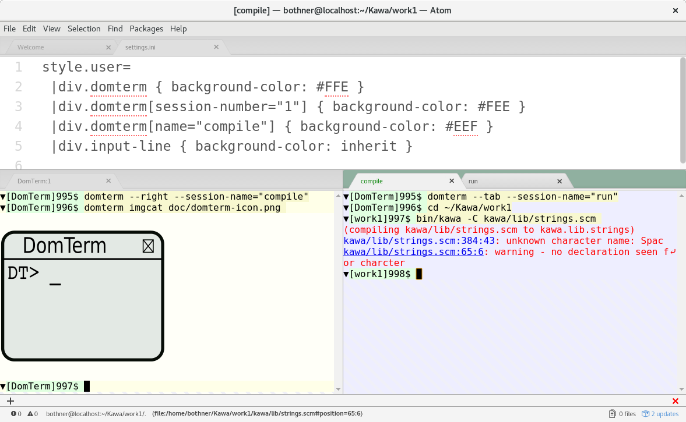

# atom-domterm
an Atom package for the DomTerm terminal emulator

DomTerm is a terminal emulator/multiplexer with lots of
nice features. Most notably you can embed graphics/html,
and session management is included.
See http://domterm.org for more about DomTerm.

The atom-domterm package requires the ``domterm`` command to be
in your PATH.  (If not, edit the ``domtermCommand`` variable
in ``lib/domterm-view.js``.)  The domterm command runs as a server,
which provides session (pty) management, and serves up the needed
JavaScript and styles.  Apart from the domterm application,
atom-domterm requires no native code or extra packages.

To run atom-domterm, place a link to the atom-domterm directory
in ``~/.atom/packages``.  Then DomTerm should come up in
the Atom ``Packages`` menu.

Note there is already an Electron wrapper for DomTerm, which
works very well.  That is included in the DomTerm sources,
and is the default user interface for DomTerm.

The atom-domterm package has only been tested on Fedora 27.
Most functionality works pretty well, though more testing
is needed.

## Features

* A solid modern terminal emulator.
  Mouse handling; 24-bit color; encodes special keys.
  Good xterm compatibility and does very well on the vttest test suite.
  Good Unicode support, including wide characters.
* Integrates well with the Atom pane system.
  The screenshot show 3 sessions, named "DomTerm:1" (default name)
  plus "compile" and "run" (in an inactive tab).
  The "window title" of the active terminal is displayed both
  in the message area and in the main title bar.
* Error message from many compilers are turned into clickable links.
  The `compile` pane of the screenshot show the effect of mouse hover
  over the warning - note the corresponding file URL in the message area.
  Clicking on the link is customizable - the default opens an atom
  editor tab positioned at the corresponding line.
* You can "print" graphics or general HTML.
  This makes domterm suitable as a "graphing calculator".
  The screenshot show an image "printed" by the `domterm imgcat` command.
  Gnuplot can [display graph output inline](http://per.bothner.com/blog/2016/gnuplot-in-domterm/).
  You can have the `man` command print HTML to the console.
  Many other possibilities.
* Remembers tab characters and distingishes explict new-line from line-wrap.
  So you can `cat` a `Makefile`, and then copy-and-paste it.
  Lines are re-wrapped on terminal re-size.
* The basic "session management" functionality of `tmux` or GNU Screen:
  You can detach and re-attach session.
* Builtin optional line-editor (like a simplified `readline`).
* Builtin optional pager (like a simplified `less`).
